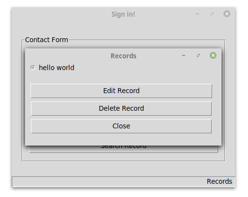
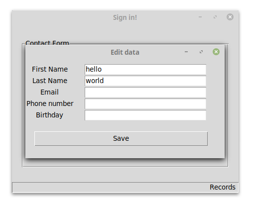

# Records
*Records* is a database app built with Python, Tkinter, and SQLite.

## How to Use
To launch the app, open the *GUI.py* script via the console. To add a record into the database, fill in the first name, last name, email, and birtday fields and click the *Add Record* button. To search a particular entry, type the text to search in its corresponding field in the contact form and click the *Search Record* button. To view all database entries, click the *Search Record* button while the contact form is blank.
To change or delete records, search and select an entry and click the *Edit Record* or *Delete Record* button. Lastly, to return to the main window, click the *Close* button.

## Technologies Utilized
* Tkinter
* SQLite

## Preview

## Conclusion
* Simple GUIs can be built with Tkinter windows and widgets. Tkinter arranges label, entry, and button widgets in a window using a grid layout. The button widgets can be linked to functions and the data in entry widgets can be extracted for use elsewhere.
* The main steps for working with a SQLite database are connecting to a database, creating a cursor object, writing an SQL query, commiting changes, and closing the database connection.
